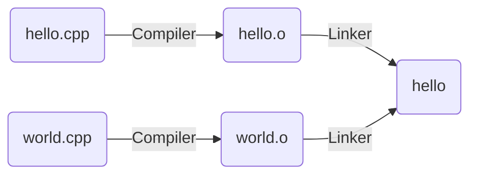

via
```bash
clang++ -c -o hello.o hello.cpp
clang++ -c -o world.o world.cpp
clang++ -o hello hello.o world.o
```

- from source code to object files with machine code
- each compile invocation compiles a **translation unit**
- combine object files into executable

>[!goal] linker also resolves all undefined references
>- error if references cannot be resolved

---
# One Definition Rule

>[!star] max one definition per name within a translation unit, exactly one definition of every used function/variable within entire program

-> linker diagnoses and outputs message

----
# Headers and Implementation files

>[!goal] split into **implementation** (`.cpp`) and **header** (`.h`) files for better overview over declarations

-> like API + its implementation

```cpp title:"Example"
// sayhello.h
#include <cstdint>
/// Print "Hello!" to standard output.
void sayHello(std::uint64_t number);

// sayhello.cpp
#include "sayhello.h"
#include <cstdint>
#include <print>
void sayHello(std::uint64_t number) { std::println("Hello␣{}!", number); }

// main.cpp
#include "sayhello.h"
int main() { sayHello(1); return 0; }
```

### Header Guards

>[!goal] transitive includes can cause problems -> wrap header

```cpp title:"Example"
// sayhello.h
#ifndef CPPLECTURE_HELLO_H
#define CPPLECTURE_HELLO_H

/// Print "Hello!" to standard output.
void sayHello();

#endif // CPPLECTURE_HELLO_H
```

### About `#include` and headers

>[!imp] include (exactly) used **header** files in header + implementation files

typical grouping:
1. accompanying header file
2. project includes
3. library includes
4. system includes

---
# Linkage

>[!goal] of a declaration: visibility across different translation units

| Type             | Names can be referenced from                                                                                                                                                   |
| ---------------- | ------------------------------------------------------------------------------------------------------------------------------------------------------------------------------ |
| no linkage       | only their own scope                                                                                                                                                           |
| internal linkage | same translation unit<br><br>- global functions/variables with `{cpp}static`<br>- const-qualified global variables w/o `{cpp}extern`<br>- declarations in anonymous namespaces |
| external linkage | other translation units<br><br>- global functions/variables (unless `static`)                                                                                                  |

```cpp title:"Example: Internal Linkage via static vs anonymous namespace"
// only for variables/functions:
static int foo = 1; // internal linkage
static int bar() { // internal linkage
return foo;
}

// preferred:
namespace {
int foo = 1; // internal linkage
int bar() { // internal linkage
return foo;
}
} // end anonymous namespace
```

---
# Declaration specifiers

>[!goal] controls [[2.2 Object Model#Storage duration]] and linkage

| Specifier           | Global function/variable   | Local variable    |
| ------------------- | -------------------------- | ----------------- |
| none                | static + external          | automatic + none  |
| `{cpp}static`       | static + internal          | static + none     |
| `{cpp}extern`       | static + external          | static + external |
| `{cpp}thread_local` | thread + external/internal | thread + none     |

```cpp title:"Example"
//--- a.cpp
static int foo = 1;
int bar = 2;
static int add(int x, int y) { return x + y; }
int countMe() {
	static int counter = 0; // static storage duration, no linkage
	return counter++
}

//--- b.cpp
static int foo = 1; // OK
int bar; // ERROR: ODR violation

// OK: a.cpp’s and b.cpp’s add have internal linkage
static int add(int x, int y) { return x + y; }
```

### `inline`

>[!goal] multiple definitions in different translation units, linker keeps only one

```cpp title:"Example"
//--- sum.h
#ifndef SUM_H
#define SUM_H
inline int sum(int a, int b) {
return a + b;
}
#endif // SUM_H

//--- a.cpp
#include "sum.h"
// Now has definition of sum
// ...

//--- b.cpp
#include "sum.h"
// Now has definition of sum
// ...
```