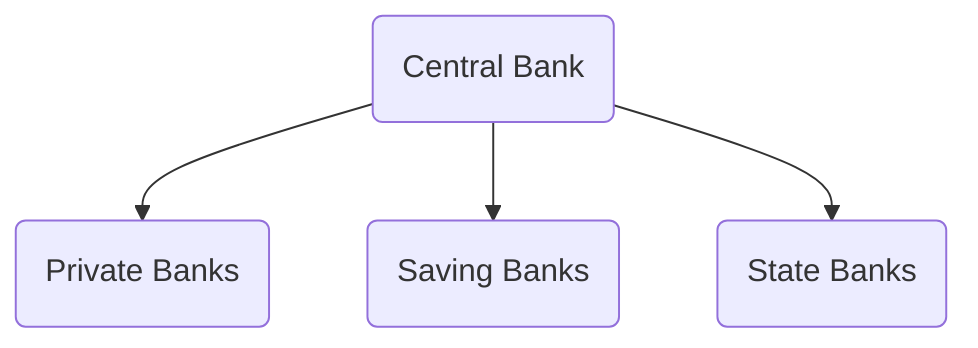

# Central Bank Money vs Bank Money

**book money**:
- is insured up to a limit
- credibility might have to be verified additionally

**central bank money**:
- physical money
- but also: [Central bank digital currency](https://en.wikipedia.org/wiki/Central_bank_digital_currency)
	- unlimited insurance
	- 2d barcodes on physical moneys
